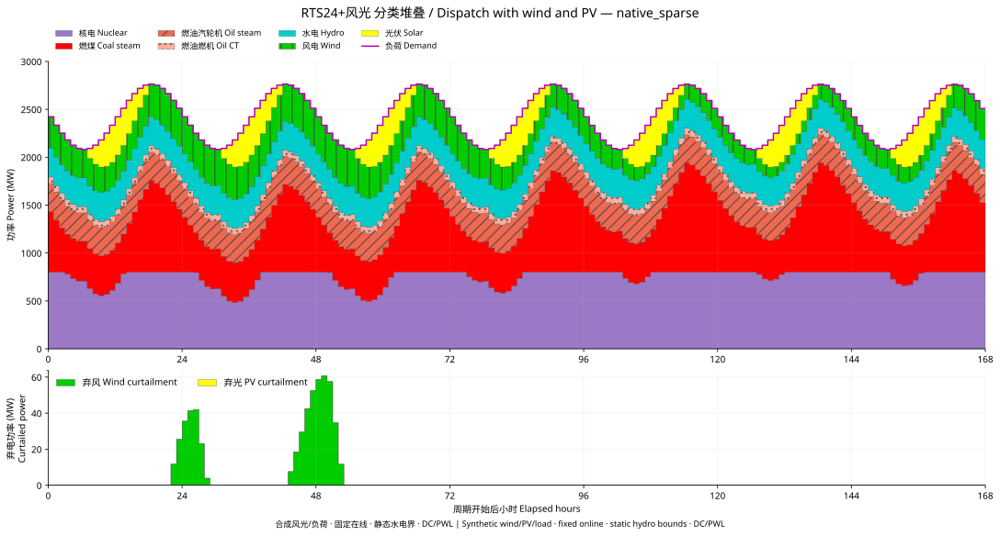
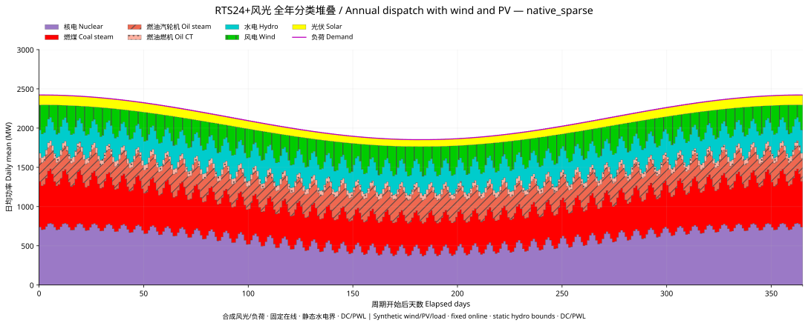
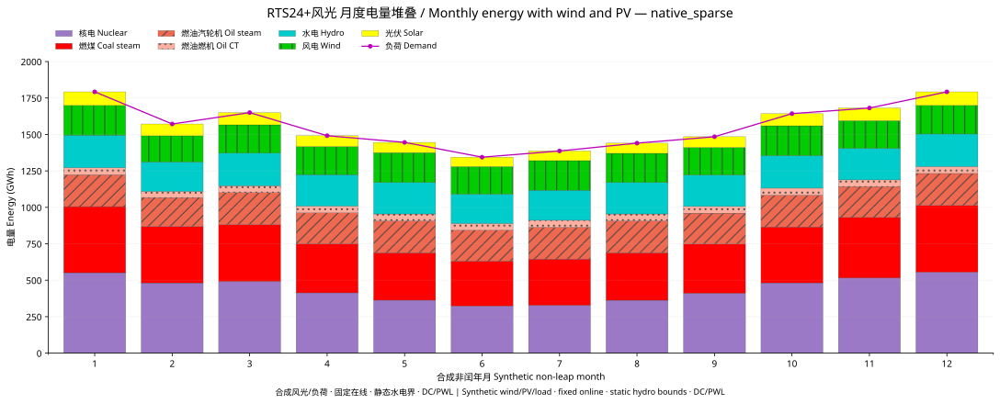
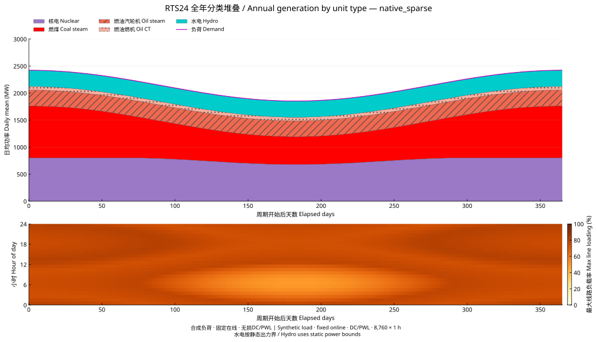
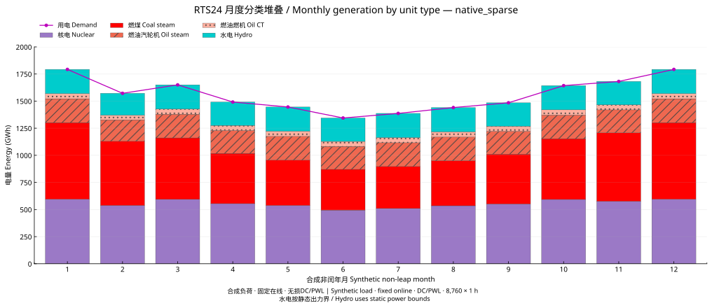
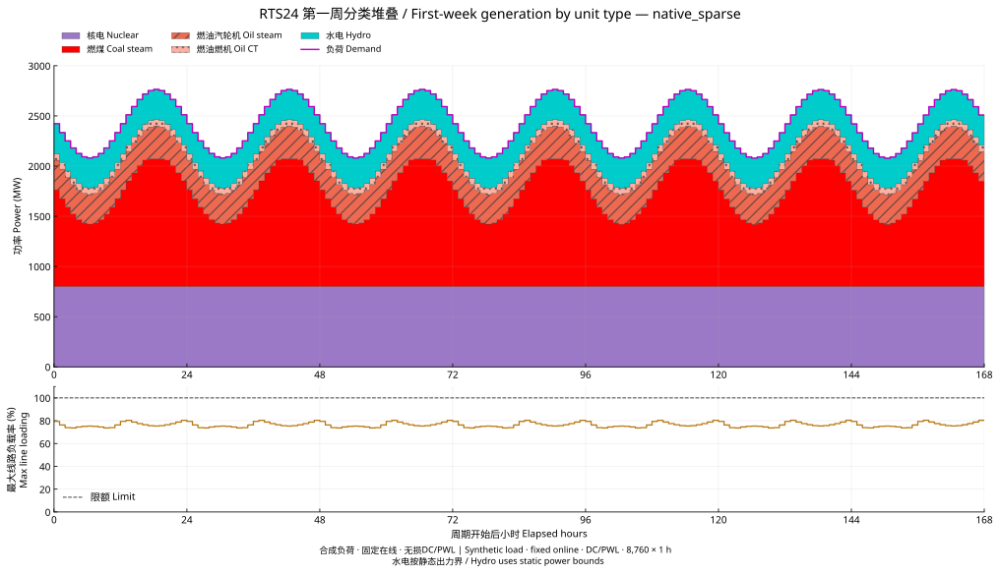
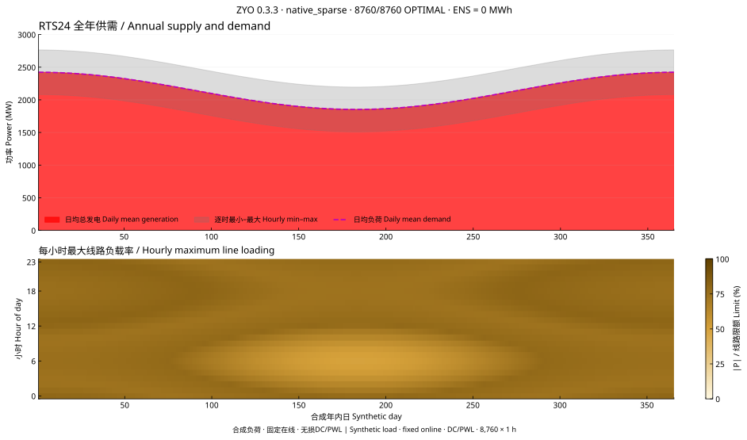
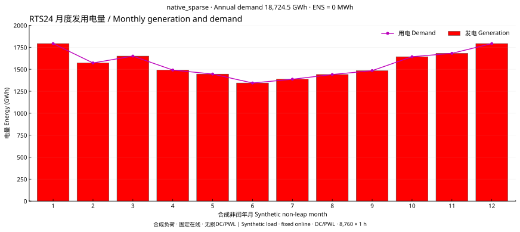
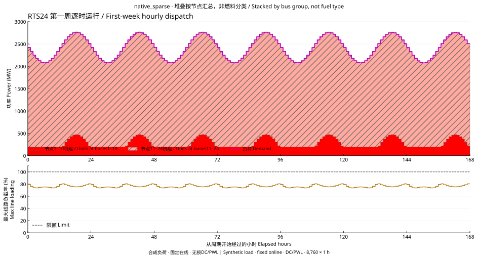

# 0.3.3 更新小结与图集 / Release summary and figures

2026-09-08 · 自主稀疏内核与年度DC调度 / Native sparse kernel and annual DC dispatch

## 完成内容 / Delivered

- 增加LP局部CSC结构复用、失效检查和独立存储；20题120次同核消融的7项数值输出一致。结构重建17,394→1,965次，逐题中位调用时间之和9.527917→9.241643秒（减少3.00%）。[方法与逐题耗时](../sparse_reuse.md)。
- 完成RTS24合成8760小时逐时自主DC/PWL调度；重新从原输入与完整解复算8760小时功率平衡、线路方程、出力界及成本，生成以下三幅中英图和[月度数据](../figures/0.3.3/monthly.csv)。
- 加入缺失/损坏实验记录、输入/协议身份和图形聚合的独立检查，落实文献优先诊断与版本图集归档。

Added per-LP CSC structural reuse with invalidation and storage-isolation checks. All120 controlled calls preserve seven numerical fields; the sum of per-case median call times decreases by3.00%. Completed and independently rechecked8760 native DC/PWL snapshots, with the three bilingual figures below and downloadable monthly data. Added record-integrity and aggregation checks, literature-first diagnosis and versioned figure archives.

## 年度实测 / Annual measurement

## 新增风光场景与图 / Added wind/PV scenario and figures

在节点3增加600 MW风电、节点10增加400 MW光伏，容量与时序均为合成开发设置。原网络、原机组及负荷曲线保持；新能源零边际成本、实发上界等于容量乘可用率，允许弃风弃光，严格供电。[线性可用率界参考](https://docs.pypsa.org/v1.0.2/user-guide/optimization/dispatch-limits/)。

Added600 MW wind at bus3 and400 MW PV at bus10 as an explicitly synthetic development overlay. The existing network, generators and demand remain unchanged. Zero-cost renewable dispatch is bounded by available power, with explicit curtailment and strict supply.

先通过24/168小时，再完成8760/8760逐时原生OPTIMAL及原始模型/物理检查。年度循环183.014秒，含出图的监督进程185.545秒、峰值RSS262.69 MiB；ENS0，PWL成本374,263,033.086937（算例成本单位）。最大节点平衡残差6.073e−8 MW、线路方程残差9.514e−8 MW。

After24/168-hour validation, all8760 native snapshots pass original-model and physical checks. The annual loop takes183.014 seconds; supervised execution including figures takes185.545 seconds, with peak RSS262.69 MiB. ENS is0; PWL cost is374,263,033.086937 in case cost units. Maximum nodal and line-equation residuals are6.073e−8 and9.514e−8 MW.

| 电量 / Energy (MWh) | 风电 / Wind | 光伏 / PV |
|---|---:|---:|
| 可用 / Available | 2,366,361.006230 | 942,633.085389 |
| 实发 / Dispatched | 2,346,989.380952 | 942,633.065280 |
| 弃电 / Curtailed | 19,371.625278 | 0.020109 |

[含风光月度分类数据 / Wind-PV monthly data](../figures/0.3.3/monthly_renewables.csv)。固定在线、静态水电出力界与DC/PWL范围适用于上述图；出力调节不等于新增启停决策。Fixed online status, static hydro power bounds and DC/PWL scope apply to these figures; dispatch variation is distinct from commitment decisions.

### 原RTS24场景指标 / Original RTS24 scenario metrics

| 指标 / Metric | 实测值 / Value |
|---|---:|
| 实际引擎与版本 / Actual engine and version | ZYO native_sparse 0.3.3 |
| 接受最优的小时 / Accepted optimal hours | 8760 / 8760 |
| 每小时变量/约束/非零元/整数 / Variables / rows / nonzeros / integers per snapshot | 128 / 248 / 595 / 0 |
| 调度循环 / Dispatch loop | 171.939 s |
| 监督进程总时间 / Supervised process time | 172.858 s |
| 进程峰值RSS / Peak process RSS | 69.68 MiB |
| 年用电量 / Annual demand | 18,724.5 GWh |
| 年PWL成本 / Annual PWL cost | 407,128,450.150720 · case cost units |
| 缺电量 / ENS | 0 MWh |
| 最大节点平衡残差 / Maximum nodal balance residual | 5.438e−8 MW |
| 最大线路方程残差 / Maximum line-equation residual | 9.487e−8 MW |
| 最高线路负载率 / Maximum line loading | 80.7664% |

**模型与来源 / Model and provenance.** [MATPOWER8.1 case24_ieee_rts.m](https://github.com/MATPOWER/matpower/blob/8.1/data/case24_ieee_rts.m)：24节点、33条机组记录（含1条同步调相机）、38条线路。各小时固定在线、无损DC、8段凸弦线成本近似，线性可行性容差1e−7。合成非闰年负荷倍率为 `0.75 + 0.12*cos(2*pi*((h%24)-18)/24) + 0.1*cos(2*pi*h/8760)`，`h=0,...,8759`。各小时是独立调度；本页图展示这一明确模型。

The network is MATPOWER8.1 RTS24, with33 generator records including one synchronous condenser and38 branches. Each snapshot uses fixed online status, lossless DC equations and an eight-segment convex chord cost approximation. The non-leap-year demand multipliers are synthetic, defined above. These figures describe independent hourly dispatch at a1e−7 linear feasibility tolerance.

来源文件SHA256 / Source SHA256: `a383a9001fd03ab54b2bc590364a71119fd07e82ab814adfd824ce08f9eb26ce`。

## 按机组类型的GTDS式堆叠图 / GTDS-inspired stacks by unit type

按用户追加要求，三图均采用分类堆叠。机型来源为[华盛顿大学RTS原始数据档案](https://labs.ece.uw.edu/pstca/rts/pg_tcarts.htm)，逐行读取MATPOWER机组的U12/U20等单位代码，并与RTS1979类型、RTS1996表9的热机/燃料类型核对：核电2台、水电6台、燃煤汽轮机9台、燃油汽轮机11台、燃油燃机4台。另1台同步调相机P=0，单独记录。

All three new figures use source-backed unit-type stacks. MATPOWER's unit-code comments are matched row by row to the original RTS type table and RTS1996 Table9:2 nuclear,6 hydro,9 coal-steam,11 oil-steam and4 oil-fired combustion-turbine units. The additional synchronous condenser has zero active power.

水电沿用青色，火电采用红色系和分型纹理，核电新增紫色，负荷用紫红线；无风光数据的本算例按实际类型出图。单位类型的补充仅用于原解分类，逐小时总功率、成本和线路结果保持原值。水电在本次静态模型中采用出力上下界；水量、库容和跨时段调节属于独立模型里程碑。

Hydro uses cyan, thermal subtypes use red shades/hatching, nuclear uses purple, and demand uses a magenta line. Classification preserves every original hourly power, cost and line result. Hydro here uses static power bounds; water, reservoir and intertemporal models have their own validation milestones.

[分类月度数据 / Monthly data by type](../figures/0.3.3/monthly_types.csv)。全年图采用逐日均值；第一周保留逐小时阶梯。五类相加逐时核对总发电量，月度按原8760小时积分。

The annual overview uses daily means, while the first week retains hourly steps. Every hourly type sum is checked against total generation; monthly GWh integrates the original8760 hours.

## 本次较早图，继续保留 / Earlier figures retained from this update

以下图是在机型资料补充前生成的总量/节点分组视图，保留原图以便溯源。The following earlier aggregate/bus-group views retain their original contents for traceability.

### 全年总览 / Annual overview

上图为逐日平均供需与小时范围，下图为365天×24小时的最大线路负载率。日均用于阅读全年结构，灰色范围保留日内波动。

Daily means and hourly ranges summarize the year; the heatmap retains hourly maximum line loading for all365 days.

### 月度电量 / Monthly energy

逐小时MW乘1小时后累加为MWh，再除1000得到GWh；月份按非闰年实际天数划分。

Hourly MW values are integrated over one hour and divided by1000 for GWh. Month boundaries use the non-leap-year calendar.

### 第一周逐时运行 / First-week hourly dispatch

预先选择第一完整周；堆叠按机组所在节点1–10与11–24汇总。红色深浅与纹理区分节点组；品红线为负荷。机组原数据未分类燃料，图例直接使用节点组名。

The first complete week is selected in advance. Stacks group generators by buses1–10 and11–24, with red shades/hatching; magenta denotes demand. Legends use the actual bus grouping available in the input data.

本页图固定归属0.3.3，历史[0.3.2机组组合与比较图](../uc_results.md)保留。后续图在对应版本小结中新增；更正采用独立修订编号。

These figures belong to0.3.3. The earlier[0.3.2 UC and comparison figures](../uc_results.md) remain available. Later results and corrections receive their own version or revision paths.
