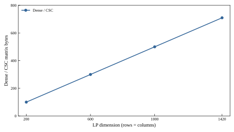

# ZYO 0.3.6 · 公共 LP 稀疏输入 / Sparse input for the public LP API

2026-09-28 · Python 3.10.19 · NumPy 2.2.6 · SciPy 1.15.3

## 算例、目标与输入 / Case, objective and inputs

本版承接 0.3.5 自研认证 LP：原先公共 `Model.solve('native_simplex')` 装配完整稠密矩阵，再由内核转稀疏表示；现在原模型直接装配 CSC 列压缩矩阵。变量、约束、目标常数、状态与独立 KKT 门保持原语义。稠密装配仍可作为显式参考入口；原生路径没有调用 HiGHS、Gurobi 或 COPT。

This release routes the certified native LP API through direct CSC assembly. The original model, objective constant, solver status and independent KKT gate retain their semantics. Dense assembly remains an explicit reference path; external optimization engines do not participate in native solving.

图 1 使用无量纲、人工构造、可手算的对角 LP，尺寸分别为 $n=200,600,1000,1420$：

$$\min x_0\quad\text{s.t.}\quad 0\le x_i\le1,\;x_i\le1\quad(i=0,\ldots,n-1).$$

每行仅一个非零系数，最优目标为 0。两个装配入口逐元素核对同一 $A=I_n$。稠密存储量取 `ndarray.nbytes`；CSC 存储量取 `data.nbytes + indices.nbytes + indptr.nbytes`，与 [SciPy CSC 数据结构](https://docs.scipy.org/doc/scipy-1.15.3/reference/generated/scipy.sparse.csc_matrix.html)一致。图中纵轴为二者比值，不是求解秒数、进程峰值内存或一般模型的加速比。

Figure 1 uses a hand-checkable synthetic diagonal LP at four dimensions. Each row has one nonzero; the analytical optimum is zero. We verify dense and CSC matrices elementwise. The ratio compares their actual matrix buffers only, not wall time, peak process memory or general-model speedup.

## 图 1：矩阵表示成本 / Figure 1: matrix representation cost



| 行数=列数 / Dimension | 非零元 / Nonzeros | Dense bytes | CSC bytes | Dense / CSC |
|---:|---:|---:|---:|---:|
| 200 | 200 | 320,000 | 3,204 | 99.88× |
| 600 | 600 | 2,880,000 | 9,604 | 299.88× |
| 1000 | 1000 | 8,000,000 | 16,004 | 499.88× |
| 1420 | 1420 | 16,131,200 | 22,724 | 709.88× |

1420 阶算例经公共 `native_simplex` 入口得到 `OPTIMAL`、目标 0、独立 KKT 证书通过，实际引擎为 ZYO 自研，未回退。此前稠密参考入口的 2,000,000 元素预登记门对 $1420^2=2,016,400$ 元素拒绝分配；当前公共稀疏入口可装配并完成该教学 LP。该输入只有对角结构，不代表一般公开 MPS、大型 MILP 或求解速度突破。完整原始 [JSON](../figures/0.3.6/Fig01_MatrixStorage/source_data/measurements.json)、[CSV](../figures/0.3.6/Fig01_MatrixStorage/source_data/matrix_storage.csv)、[绘图脚本](../figures/0.3.6/Fig01_MatrixStorage/scripts/plot_python.py)及[QA](../figures/0.3.6/Fig01_MatrixStorage/qa/figure_qa.json)随图保存。

The 1420-dimensional case solves through the public self-developed API with status `OPTIMAL`, objective zero and a verified independent KKT certificate, without fallback. The former dense reference gate is 2,000,000 elements; $1420^2=2,016,400$ lies above it. This diagonal case demonstrates sparse-input reachability, not broad MPS/MILP coverage or a runtime gain. Raw data, renderer source and QA travel with the release-specific figure.

Origin 试绘导出带 `demo` 水印，故公开图实际由 Python/matplotlib 绘制；本图提供可重绘的 CSV 与 Python 脚本。历史版本图文保留原路径。

The attempted Origin export contained a `demo` watermark. The published figure therefore uses Python/matplotlib, declared in its QA record; earlier release figures remain unchanged.

## 验收与复现 / Validation and reproduction

本版完整研发回归468项通过（38.729秒）；四个Netlib开发MPS各三新进程，12/12独立原尺度KKT与参考目标复核通过，最大相对误差1.101×10⁻¹⁵。白名单150文件完成源码/导出核对；wheel与隔离安装64个实现模块逐字节一致，sdist148个必需文件及六份授权/来源声明一致。隔离环境非 editable wheel 安装后，`-I` 模式从导出树运行292项公开测试通过，`pip check`和CLI版本0.3.6通过。新增的失败注入测试验证了1420阶求解门在写出测量结果前执行，重绘测试验证了新目录输出与随版图互不覆盖；CSV、JSON、SVG固定LF换行，Git属性使Windows检出保留源表字节，图QA中的原表SHA-256可对发行文件直接复算。逐步复现矩阵测量：

The development suite passes468 tests (38.729s); four Netlib development MPS files each pass three fresh native workers, with12/12 independent original-scale KKT/reference audits and maximum relative reference error1.101×10⁻¹⁵. All150 screened files match their source,64 implementation modules match wheel and isolated installation,148 required sdist files and six notices match. A non-editable Windows installation passes292 exported tests under `-I`, `pip check`, and the0.3.6 CLI. Failure injection verifies the large-case gate before publication; redraw testing preserves the shipped figure. CSV, JSON and SVG use stable LF endings, and Git attributes preserve those bytes on Windows checkout for direct QA SHA-256 verification.

```powershell
python -m venv .venv
.\.venv\Scripts\python.exe -m pip install -e ".[native-sparse,storage]"
.\.venv\Scripts\python.exe -B -X utf8 tools\measure_public_lp_input.py --output my-matrix-measurement
.\.venv\Scripts\python.exe -B -X utf8 docs\figures\0.3.6\Fig01_MatrixStorage\scripts\plot_python.py --output my-redrawn-figure
.\.venv\Scripts\python.exe -B -X utf8 -m unittest tests.test_public_lp_input_measure -v
```

测量脚本写入新目录 `measurements.json` 与 `matrix_storage.csv`；版本图的原数据保留在 `docs/figures/0.3.6/Fig01_MatrixStorage/source_data`。本地 Python 求解无需远程 API 密钥，受限新增内容依 [许可范围](../../LICENSE-SCOPE.json)与获批用途使用。

The script writes a fresh JSON/CSV pair; this release's measured source stays beside Figure 1. Local solving needs no remote API key, and eligible new expression follows the scoped testing license.

## 使用意义与后续 / Research meaning and next step

公共输入不再先分配 $O(mn)$ 稠密系数表，便于课题组用同一 Python 模型研究稀疏 LP。下一步以实际稀疏通用题剖析装配、归一化、Phase-I、基求解和证书的分段成本，并在相同资源预算下记录完整状态与数值；性能结论必须独立测量求解耗时、峰值内存和失败实例。已有开发大题的退化 Phase-I 将按冻结失败证据研究，不从图 1 推出其求解能力。

The direct sparse input removes the dense coefficient-table allocation on this path. Future work separates assembly, normalization, Phase I, basis solves and certification on sourced LPs under frozen budgets, retaining failed cases and measured wall time/RSS. Figure 1 alone does not establish industrial-scale solving capability.
