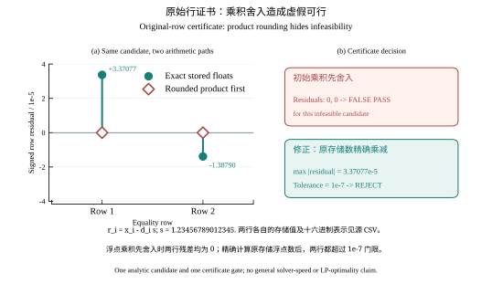
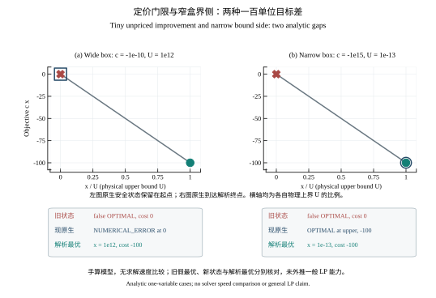

# ZYO 0.3.7 本地发布候选：原 LP 证书与数值边界 / Local release candidate: original-LP certification and numerical boundaries

2026-10-05 · 本页随筛选源码候选编写；正式发布以冻结源码、净安装及逐文件发布回执为准。 / Prepared with the screened source candidate; final release identity follows the frozen-source, clean-install and file-identity receipts.

## 前因、输入与计算 / Motivation, inputs and computation

本次增量针对同一原始 LP 的三个具体误判入口：浮点乘积先舍入会抵消非零行残差；小于入基选择门的改善项会被误当作最优性证明；极窄变量盒的两侧会同时落入绝对“近界”判断。另对 CSC/CSR 同一坐标的重复系数，在进入原生齐次模型与独立证书前采用相同的 binary64 汇总语义。所有下述教学输入由解析常数构造，无第三方基准或私人论文数据。原生求解使用 ZYO 自编定价、比值和基维护；NumPy/SciPy 仅提供数组、稀疏矩阵和线性代数。

This increment addresses three concrete ways an original LP could be misreported: product-first rounding can cancel a true row residual, an entering-column threshold can be mistaken for an optimality proof, and a narrow box can be assigned the wrong active side. Duplicate CSC/CSR entries now have the same binary64 aggregation meaning in the native homogeneous model and the independent original-model certificate. The examples below are analytic project-constructed inputs, not third-party benchmark data. NumPy/SciPy provide only numerical primitives.

对一般线性目标和行约束，结果门重新核查原存储 binary64 数所定义的模型：

$$\min\{c^Tx+c_0: \ell\le x\le u,\ Ax\ \mathrel{\square}\ b\},\qquad
r_j=c_j-a_j^T\lambda.$$

在**准备接受**原始可行或最优状态时，对必要的乘积分别作精确有理乘加，再按原设定容差比较原行违反、界、对偶符号、简约成本、互补与原始—对偶差。这里的精确算术是**事后证书核验**，不是以有理数运行整套单纯形。对有界的小基，另可求 $B^Ty=c_B$ 提议原行乘子；只有独立原模型证书完整通过，公共结果才按既定容差报告 `OPTIMAL`，同时保留底层 `raw_status=NUMERICAL_ERROR`、原因和 `fallback_used=False`。辅助基限于最多 8 行、64 列，资源门之外保留原停止状态。

The exact arithmetic is a posthoc certificate on the originally stored binary64 data, not an exact simplex algorithm. A bounded small-basis solve of $B^Ty=c_B$ proposes multipliers; full original-model KKT acceptance remains mandatory. The public certified status and underlying native numerical stop are both recorded, with no external-solver fallback.

独立行核验的关键实现是**先精确乘加，再比较原容差**；不把浮点乘积先舍入的结果当原式：

```python
# 证书入口中的原行计算示意；实际代码还区分 <=、>=、== 与非有限分支。
from fractions import Fraction

activity = Fraction.from_float(float(expression.constant))
for column, coefficient in expression.terms.items():
    activity += (Fraction.from_float(float(coefficient))
                 * Fraction.from_float(float(point[column])))
```

The snippet shows the stored-input arithmetic of one original row. The implementation separately checks relation direction, bounds, dual signs and gap before accepting a certificate.

## 图 1：乘积抵消反例 / Figure 1: product-cancellation adversary

令 $s=1.23456789012345$，两行 $x_i-d_i s=0$。输入 $d_1=1151660734277$、$d_2=1644039625535$，候选 $x_1=1421803362854.3792$、$x_2=2029678531776.0918$。若先在 binary64 计算 $d_i s$，表观残差均为 0；对这些**已经存储**的浮点数精确乘减后，残差分别为 $+3.3707726085685508\times10^{-5}$ 与 $-1.3878964431723873\times10^{-5}$，都超过本教学输入的行绝对容差 $10^{-7}$。原证书应拒绝该候选的可行性，不能仅凭舍入后的零报告成功。



图 1 的菱形表示“乘积先舍入”的零残差，圆点表示原存储数的精确乘减；右侧仅示意对这一候选的验收差别。源表是[固定常数与十六进制浮点表示](../figures/0.3.7/Fig01_Cancellation/source_data/analytic_rows.csv)，并附[可编辑绘图脚本](../figures/0.3.7/Fig01_Cancellation/scripts/render.py)与[QA/后端声明](../figures/0.3.7/Fig01_Cancellation/qa/figure_qa.json)。图展示数值反例，不是求解速度曲线。

Figure 1 contrasts a product-first rounded zero with the exact residual of the stored inputs. The source CSV, reproducible renderer and QA travel with this version. It illustrates one certificate arithmetic failure mode, not a speed comparison.

绘图后同一测试文件增补了证书拒绝路径；图 1 的原 CSV、SVG 与绘图脚本字节未改。[QA](../figures/0.3.7/Fig01_Cancellation/qa/figure_qa.json)分别保留绘图时和发行时的测试源码哈希，避免把测试扩充误作图数据更新。 / The test module gained additional certificate controls after rendering. The figure CSV, SVG and renderer remain byte-identical; QA keeps both the render-time and release-time test hashes.

## 图 2：微小定价与极窄盒 / Figure 2: tiny pricing and narrow box

两个无量纲模型均为 $\min cx$、$0\le x\le U$。宽盒取 $(c,U)=(-10^{-10},10^{12})$，窄盒取 $(-10^{15},10^{-13})$；两者手算终点目标都是 $cU=-100$。若从 $x=0$ 起步，宽盒的严格改善成本 $10^{-10}$ 小于当前入基选择门 $10^{-9}$，原生底层保守报告 `NUMERICAL_ERROR`，保留未定价原因，而非在目标 0 证明最优；窄盒精确界侧优先，正确翻界到目标 $-100$。把宽盒改成无上界时，微小负成本对应无界改善，进一步证明“未挑中入基列”不能等同最优。



图 2 横轴 $u=x/U$ 仅为展示变换，原模型仍使用各自的真实变量界；红叉为旧错误状态，蓝标记是当前底层状态，绿点是手算终点。[源 CSV](../figures/0.3.7/Fig01_UnpricedNarrow/source_data/analytic_cost_paths.csv)用十进制精确乘法生成五个位置的成本，并附[脚本](../figures/0.3.7/Fig01_UnpricedNarrow/scripts/render.py)及[QA](../figures/0.3.7/Fig01_UnpricedNarrow/qa/figure_qa.json)。两图原始版本与既有图集保持原路径和字节；本版各图有独立目录。

Both models have an analytically known endpoint cost of $-100$. The wide case retains an unresolved raw native stop instead of a false optimality claim; the narrow case reaches the correct bound side. The normalized horizontal display does not change either original LP.

## 公共四行认证与重复系数 / Four-row certification and duplicate entries

另一个手算模型为自由变量 $p,q$、$v\ge0$：

$$\max v\quad\text{s.t.}\quad p+v\le1,\ q+v\le1,\ p-2q+v\le0,\ -2p+q+v\le0.$$

$(p,q,v)=(1/2,1/2,1/2)$ 可行；非负行权重 $(1/2,0,1/6,1/3)$ 组合后得 $v\le1/2$，因此该点确为全局最优。测试要求在底层微小未定价停止后，≤8 行精确基乘子建议与**原模型独立证书**同时成立，公共 `native_simplex` 才能报告按既定容差认证的目标 $0.5$；元数据继续显示原始数值停止原因和实际后端。该认证不把所有 `NUMERICAL_ERROR` 或其他大问题自动升级。

The independent weighted-row argument proves the $0.5$ optimum. The native small-basis reconstruction and original-model certificate are checked separately; the public status retains the underlying stop in metadata.

再以单行重复 CSC 输入验证模型一致性：$(-2\times10^{-10}-10^{-10})x+y\le1$、$0\le x\le10^{12}$，目标 $\max -2\times10^{-10}x+y$。$(x,y)=(10^{12},300)$ 原式可行、目标 100，故 $(0,1)$ 不可能是最优。原生齐次矩阵和证书模型现在按同一重复项合并规则解释为系数 $-3\times10^{-10}$，且调用方稀疏数组保持逐项不变；有限项求和溢出为非有限值时明确拒绝输入。

The duplicated coordinate is summed consistently before either native solving or original-model certification. The caller's sparse storage is unchanged, and a nonfinite aggregate is rejected. The explicit feasible point with objective 100 prevents a false optimality claim at objective 1.

## 可复现入口与研究意义 / Reproduction and research use

安装 `.[native-sparse]` 后可运行公开手算测试，或按[原生认证 LP 教程](../native_simplex.md)自行建模：

```powershell
python -B -m unittest tests.test_lp_certificate_product_cancellation tests.test_sparse_simplex_unpriced_gap tests.test_native_lp_duplicate_entries tests.test_native_simplex_posthoc_metadata tests.test_exact_basis_dual -v
```

图件实际后端为 Python/matplotlib Agg：同日 Origin 原生试画带演示水印，故按绘图规范回退并保留可重绘源脚本。图中文字、源表、首末轴端刻度和后端证据见各自 QA。两图均为数值正确性教学，不代表全局求解速度、公开大题覆盖或商业求解器水平。

After installing `.[native-sparse]`, the listed analytic tests and bilingual LP guide reproduce the intended paths. The figures use the disclosed Python fallback and retain source/QA. The scientific takeaway is a narrower, auditable acceptance boundary: a candidate, a raw native stop and a verified optimum are distinct outputs. Larger LP/MILP coverage and performance are evaluated by separately frozen suites and resource-matched experiments.

同候选源码再对公开 Netlib **开发题** `afiro`、`adlittle`、`sc50a`、`sc50b` 各运行三次并按原输入独立复核，严格原模型证书 **0/12** 通过：前后两题虽有接近参考目标的候选，证书仍拒绝；中间两题保留数值停止。测试用实际原生 `native_simplex`，未回退、未调用外部求解器。这个负面结果与上述手算四行认证一同界定本版验证范围。 / A same-source replay of four public Netlib **development** cases, three runs each, accepts **0/12** under the stricter original-model certificate. `afiro` and `sc50b` have candidates near reference objectives but failed certification; `adlittle` and `sc50a` retain numerical stops. All runs used the native engine with no fallback or external optimizer calls.

许可继续采用[分范围非商业测试条款](../../LICENSE-SCOPE.json)，历史 MIT 基线与第三方权利按原声明保留。本地 `import zyo` 无需远程 API 密钥；远程 API 的权限另行管理。 / Licensing retains the scoped noncommercial testing terms and inherited MIT/third-party rights. Local `import zyo` does not require a remote API key; prospective API access is separately controlled.
