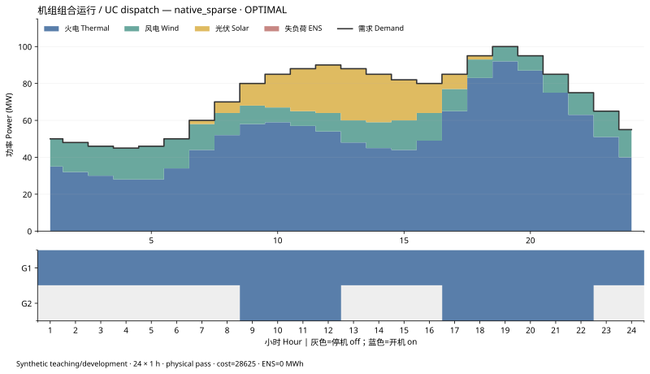
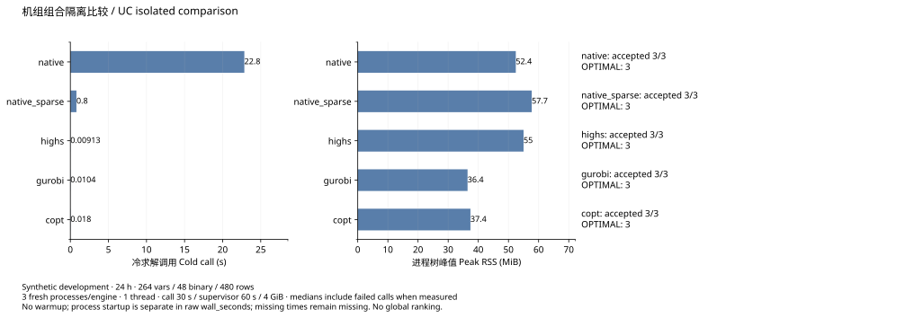

# 24h 机组组合实测 / Measured 24-hour unit commitment — 0.3.1

2026-09-08，合成教学/开发输入 `examples/uc_24h.json`：24×1h、2台固定容量机组、264变量、48二进制、480约束、1537非零元。模型为单节点有限时域 MILP，完整假设见 [建模与复现教程](unit_commitment.md)。开发实例与保留测试集分开管理。

ZYO 稀疏原生三次均返回 OPTIMAL 并通过独立原始约束、整数、物理、成本和界检查：目标 `28625.000009868018`，最优界 `28624.99999612956`，归一化 Gap `4.79946e-10`，最大物理残差 `2.17679e-8`，ENS `0 MWh`，21节点/214迭代。三种隔离比较引擎均返回目标 `28625`。不同最优轨迹均可接受。

| 实际路径 / Actual engine | 通过 / Accepted | 实际状态 / Status | 冷调用中位 s / Median call s | 采样峰值中位 MiB / Median peak RSS |
|---|---:|---|---:|---:|
| ZYO native 0.3.1 | 3/3 | OPTIMAL | 22.8482746 | 52.43 |
| ZYO native_sparse 0.3.1 | 3/3 | OPTIMAL | 0.7995304 | 57.72 |
| HiGHS 1.8.0 | 3/3 | OPTIMAL | 0.0091327 | 55.01 |
| Gurobi 13.0.2 | 3/3 | OPTIMAL | 0.0104294 | 36.43 |
| COPT 8.0.6 | 3/3 | OPTIMAL | 0.0179956 | 37.38 |

密集原生修复后成本约28625，25节点/26272迭代，三次通过全部验收门。历史0.3.0在该输入上为根Phase-I失败（487迭代），其0.584秒是失败耗时，不与当前成功求解计作速度提升。24h原生稀疏本例调用约为Gurobi的77倍；只描述此开发实例，不是通用性能倍率或全球排名。

[绘图数据 / Plot data CSV](figures/uc_comparison.csv)

## 统一资源与验收口径 / Protocol

- 同机 Windows、AMD Ryzen 9 9950X（16核32逻辑处理器），Python3.10.19、NumPy2.2.6、SciPy1.15.3。实际比较每进程请求1线程，数值库线程环境均1；完整结果单列各引擎实际接受及未映射参数。
- 每路径3个新进程，随机顺序种子20260908；无预热，冷 `model.solve` 调用计时与包含启动、导入、检查的监督进程墙钟分开保存。
- 请求求解30s、监督60s、4GiB；节点10000、迭代100000；可行性/整数容差1e-7、目标参数1e-8、请求mip_gap0。实际接受门另以原始候选、独立物理/成本和归一化界差检查；浮点Gap并非精确零。
- 成本比较与已知28625一致；Gap定义为 `abs(objective-bound)/max(1,abs(objective))`。ENS与约束可行性分开。失败计时保留、缺失值不记零；RSS为0.1秒间隔的进程树采样峰值，可能漏掉短峰。
- 所有路径读取相同冻结未求解模型；原生进程封锁外部优化模块，比较结果不回传自主求解。输入SHA256 `4bcda8ca3325b0fec02fa65c29550762f6bf98c9a396eb6e6f05aad7ce547abf`；数学指纹 `bcd11bfb8b748ce83075adcc388290510fe141ffcc5a3754028165e26fe0be85`。

## English

The synthetic fixture has24 hourly periods, two units,264 variables,48 binaries,480 constraints and1537 nonzeros. All three attempts of each native engine now pass the independent gates. Dense native reaches cost28625 with25 nodes/26272 iterations; sparse-native objective/bound/residuals are listed above. ENS is zero. The three isolated references obtain28625. The old dense0.3.0 result was a487-iteration Phase-I failure; its shorter failed-attempt time is not a successful-solve speed comparison.

Measurements use the same Windows/Ryzen 9 9950X host, Python 3.10.19, NumPy 2.2.6 and SciPy 1.15.3. Three fresh processes per engine run in seeded randomized order with one requested thread, 30-second solve / 60-second process budgets and 4 GiB RSS supervision. No warmup is used. Solve-call time and complete process wall time are separate; RSS samples are taken every 0.1 seconds. Failures stay in the table. Requested feasibility/integer tolerances are 1e-7 and mip_gap is zero; returned floating-point gaps are checked explicitly using the stated formula, not rounded into exact proof.

Every engine receives the identical frozen unsolved model. External results never enter the native computation. The sparse-native call is roughly77× Gurobi on this fixture only, not a general ratio or global rank. Network SCUC, annual UC and probabilistic adequacy have separate milestones. Use the tutorial to reproduce the native example and measure your own runtime.
